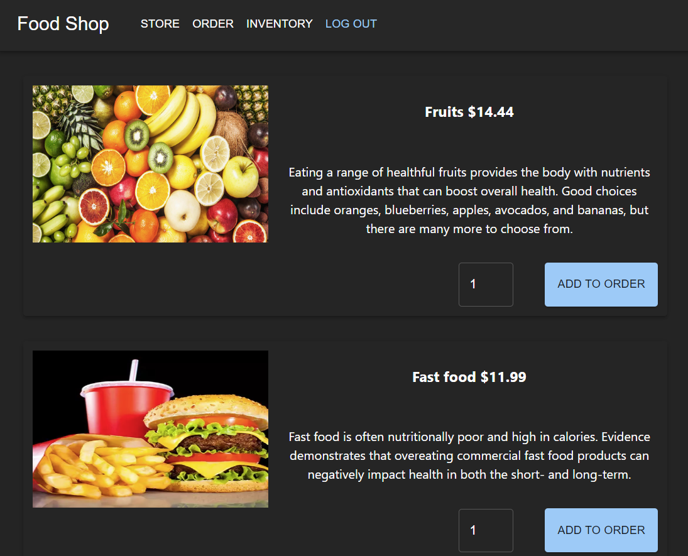
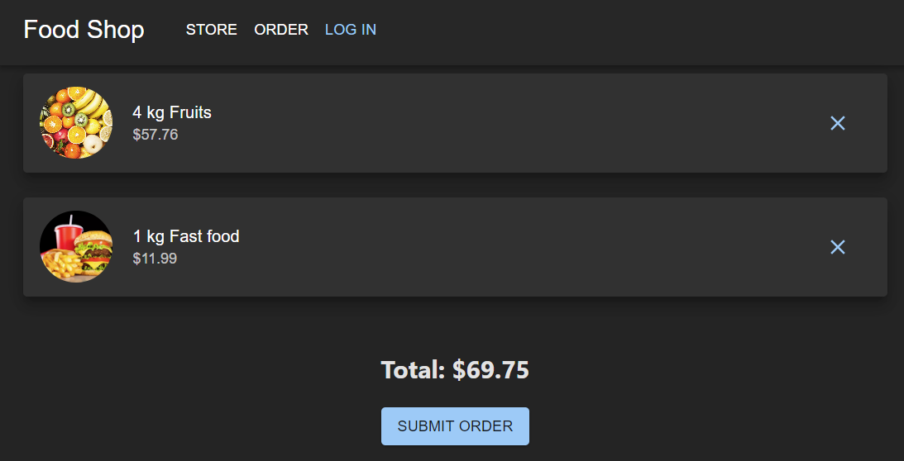
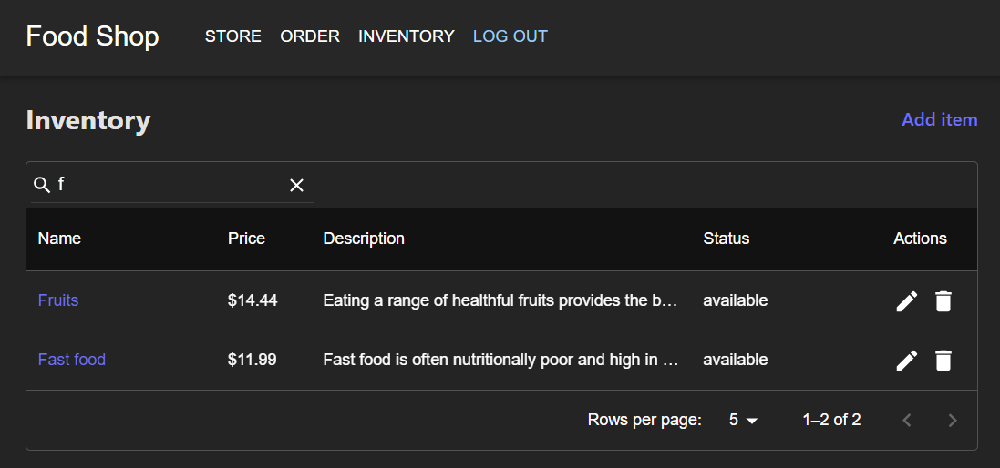

# Food store

App represents a food store and consists of three parts.

## Store page

A page where you can browse items, add to order.

## Order page

A page where you can check your order, submit it.

## Inventory

A page where an admin can manage items in a store.

